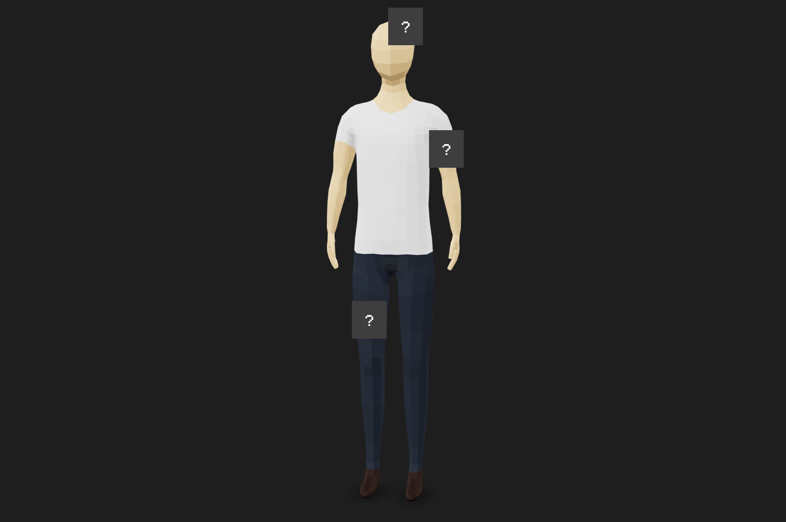
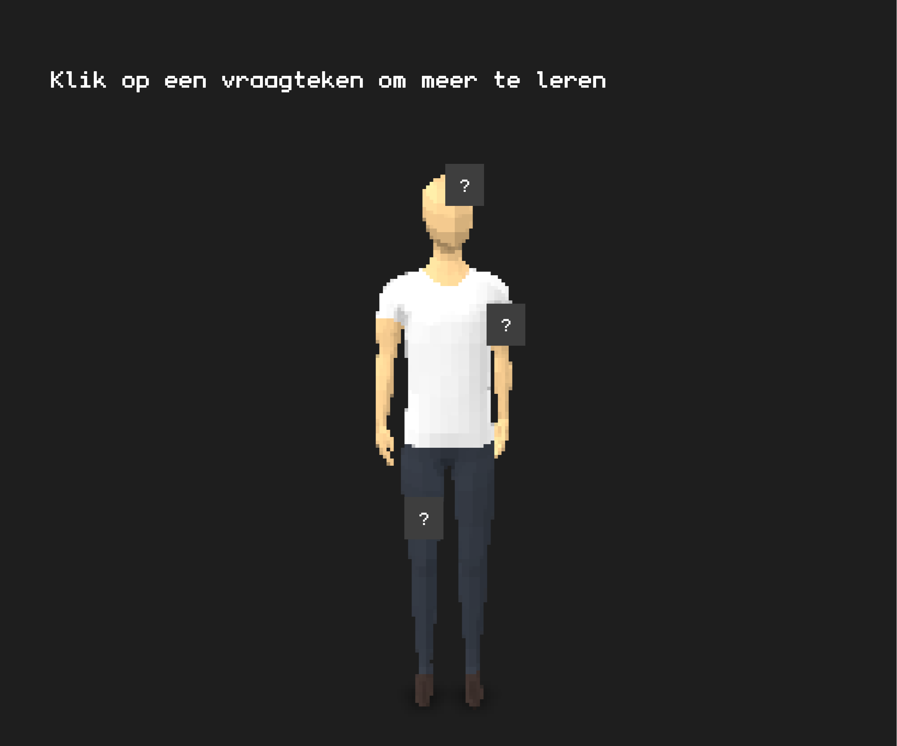
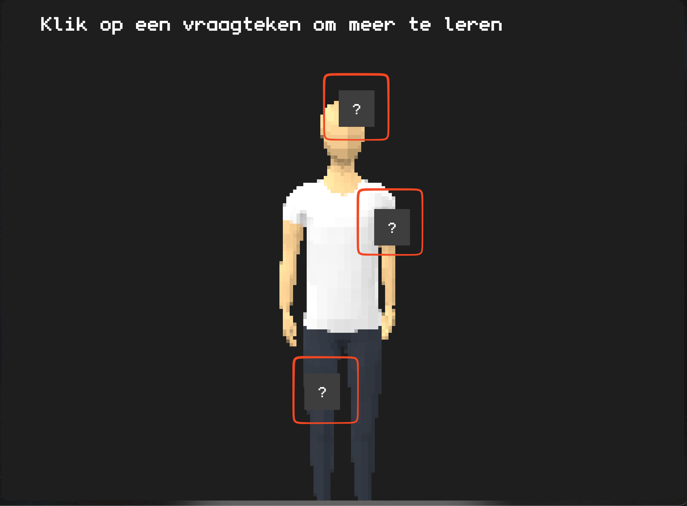
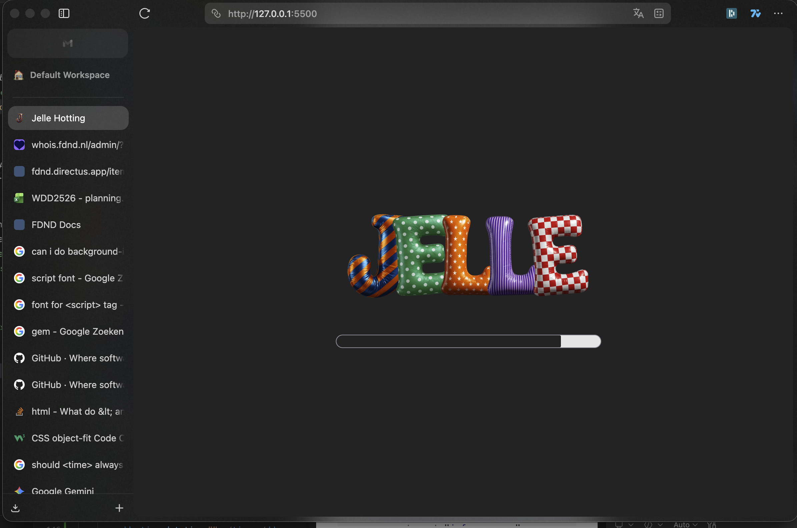
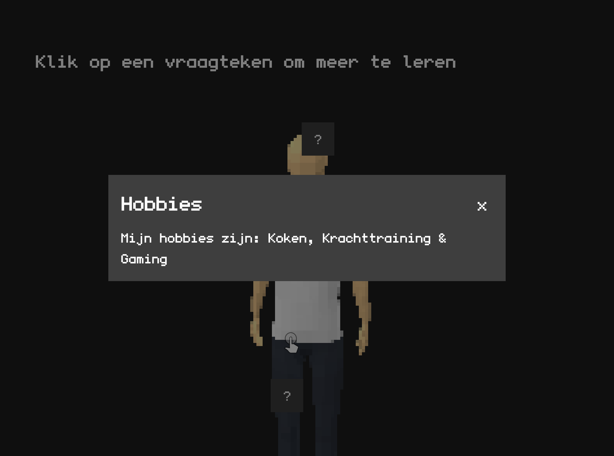
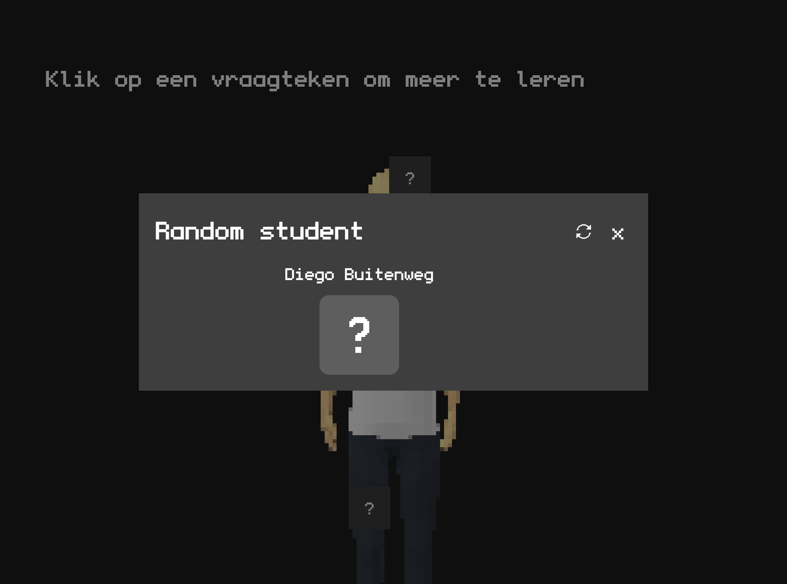

# Minor Web Development

## Sprint 1

### Leerdoelen

**Samenwerken met code**
* Ik wil effectief samenwerken met Git (branches, pull requests en code reviews), zodat we veilig en duidelijk kunnen bouwen aan dezelfde codebase.
    * Reden: Dit is essentieel voor professionele softwareontwikkeling en teamwork.

**CSS Animaties & Keyframes**
* Ik wil complexe CSS animaties en keyframes kunnen ontwerpen, zodat ik interactieve, duidelijke micro-interacties en state-changes kan bouwen.
    * Reden: Animaties verbeteren de gebruikerservaring en maken interfaces intuïtiever.

**Responsive & Semantiek**
* Ik wil een toegankelijke en responsive interface bouwen met semantische HTML, goede contrasten en duidelijke navigatie, zodat mijn projecten bruikbaar zijn op elk device.
    * Reden: Accessibility en responsiveness zorgen voor inclusieve, gebruiksvriendelijke websites.

---

## Dag 1

### Wat heb ik gedaan vandaag?

| Activiteit | Duur |
|------------|------|
| Vraagtekens toegevoegd aan het 3D model waar je op kan klikken, en hierna een pop-up | 1,5 uur |
| Workshop gevolgd over API gebruik en JSON | 2,5 uur |
| Pop-up styling doen | 1 uur |
| Kleine pauze | 1 uur |
| Lezing van Killian | 1,5 uur |



### Wat heb ik geleerd?

* Dat een `<dialog>` element alleen te gebruiken valt wanneer je een form gebruikt
* Hoe je event listeners kunt toevoegen aan specifieke delen van een 3D model (vraagtekens als clickable elements)
* Het verschil tussen pop-ups en modals in HTML/CSS en wanneer je welke gebruikt
* Basis principes van API calls en hoe JSON data wordt gestructureerd en verwerkt
* Hoe je interactieve elementen in een 3D scene kunt detecteren en erop kunt reageren
* Best practices voor het stylen van overlay elementen zoals pop-ups

### Wat ga ik morgen doen?

- [x] Animatie toevoegen aan een model
- [x] Geheime knop toevoegen
- [x] Loading animatie toevoegen

---

## Dag 2

### Wat heb ik gedaan vandaag?

| Activiteit | Duur |
|------------|------|
| Animatie toegevoegd aan model wanneer je op een geheime plek klikt | 1,5 uur |
| Workshop gevolgd over HTML | 1 uur |
| Loading animatie toegevoegd voordat de pagina laadt | 3 uur |
| Kleine pauze | 1 uur |
| Github en README bijwerken | 1,5 uur |



### Wat heb ik geleerd?

* Dat je een `<progress>` element kan gebruiken voor een progressbar, zoals die tijdens het laden van de website
* Animatie toevoegen aan `<model-viewer>` en dit koppelen aan een eventListener
* Filter toevoegen aan `<model-viewer>` door middel van `<effect-composer>`

### Wat ga ik morgen doen?

- [x] Verschillende states toevoegen (dark en light mode)
- [x] API toevoegen
- [x] Responsive toevoegen

---

## Dag 3

### Wat heb ik gedaan vandaag?

| Activiteit | Duur |
|------------|------|
| Pixelate filter toegevoegd | 1,5 uur |
| Geheime keyboard shortcut toegevoegd voor cheatsheet | 2,5 uur |

### Wat heb ik geleerd?

* Hoe je dynamisch een pixelate effect toevoegt en deze dynamisch veranderd
* Met javascript checken voor een darkmode/lightmode change
* Dat je soms de browser moet updaten

### Wat ga ik morgen doen?

- [x] Weekend

---

## Weeklog 1

### Werkzaamheden (samengevat)
* Interactieve hotspots en popovers gebouwd op het 3D model
* Animaties toegevoegd (secret hotspot + loading)
* Pixelate filter toegevoegd aan het model
* Keyboard shortcut/cheatsheet gemaakt
* API functies gemaakt voor random student en mijn eigen data
* JSON/XSS getest + error handling toegevoegd
* Workshops HTML en API/JSON gevolgd

### Wat ik geleerd heb
* Verschil tussen pop-overs en dialog en wanneer je welke gebruikt
* Event listeners op specifieke 3D elementen en koppelen aan animaties
* API calls maken, data ophalen en fouten afvangen
* Donkere/lichte mode detecteren en hierop reageren






### Code highlights

```html
<button
    class="Hotspot"
    slot="hotspot-2"
    data-surface="0 0 1020 1022 1023 0.879 0.052 0.068"
    popovertarget="info-popover"
>
    ?
</button>
<div id="info-popover" popover>
</div>
```

```css
.balloon-letters li:nth-child(1) {
    rotate: 3deg;
    animation: appearFromBelow 0.6s cubic-bezier(0.68, -0.6, 0.32, 1.6) 0s forwards;
}

@keyframes appearFromBelow {
    0% {
        opacity: 0;
        transform: translateY(100%);
    }
    100% {
        opacity: 1;
        transform: translateY(0);
    }
}
```

```javascript
async function getData() {
    const baseEndpoint = "/person?filter[squads][squad_id][tribe][name]=CMD%20Minor%20Web%20Dev&filter[squads][squad_id][cohort]=2526";
    const countResponse = await fetch(`${API_URL}${baseEndpoint}&limit=0&meta=filter_count`);
    const { meta } = await countResponse.json();
    const totalCount = meta?.filter_count ?? 0;

    const randomOffset = Math.floor(Math.random() * totalCount);
    const response = await fetch(`${API_URL}${baseEndpoint}&limit=1&offset=${randomOffset}`);
    const { data } = await response.json();
    const { name, avatar } = data[0];

    skillsParagraph.textContent = name;
    skillsImage.src = avatar;
}
```

---

## Dag 4

### Wat heb ik gedaan vandaag?

| Activiteit | Duur |
|------------|------|
| API Functie geschreven voor random persoon uit database halen | 2 uur |
| API Functie geschreven voor data van mezelf uit database halen | 1 uur |
| XSS Script in mijn json bestand zetten | 1,5 uur |
| Pauze (x3) | 1,5 uur |


### Wat heb ik geleerd?

* Hoe je API calls maakt en data opvraagt uit een database
* Error handling implementeren bij API calls
* Hoe je succesvol XSS implementeert in een JSON bestand

### Wat ga ik morgen doen?

- [x] Jean-Carlos helpen met theming
- [x] Mijn eigen data structueren en leerdoelen invullen

---

## Dag 5

### Wat heb ik gedaan vandaag?

| Activiteit | Duur |
|------------|------|
| Jean-Carlos geholpen met de verschillende themings | 2 uur |
| Data van mezelf in de API zetten | 1 uur |
| Workshop gevolgd over typografie | 1,5 uur |
| `<time>` tag toegevoegd en mijn leeftijd omgerekend | 1,5 uur |
| Pauze | 1 uur |

### Wat heb ik geleerd?

* Wat een goeie placeholder tekst is voor tags die gevuld worden door API data
* Hoe je een functie schrijft om een geboortedatum naar een leeftijd om te zetten

### Wat ga ik morgen doen?

- [x] Leerdoelen opstellen voor de minor

---

## Dag 6

### Code Review
* Geen camel case gebruiken in HTML CSS
* Eerste variabele declareren in CSS en JS daarna de rest
* Line height van 1.5

---

## Bronnenlijst

### APIs & Services
- **Directus CMS** - Directus.io
  - API Endpoint: `https://fdnd.directus.app/items`
  - Gebruikt voor: Person data, student informatie, avatar afbeeldingen
  - Documentatie: https://docs.directus.io/reference/introduction.html

### Libraries & Frameworks
- **Google Model Viewer** - v1.x
  - CDN: `https://cdn.jsdelivr.net/npm/@google/model-viewer/dist/model-viewer-module.min.js`
  - Voor: 3D model rendering en interactie
  - Docs: https://modelviewer.dev/

- **Model Viewer Effects** 
  - CDN: `https://cdn.jsdelivr.net/npm/@google/model-viewer-effects/dist/model-viewer-effects.min.js`
  - Voor: Pixelate effect en visual effects
  - Docs: https://modelviewer.dev/docs/index.html#effects

- **Three.js** - v0.172.0
  - CDN via importmap: `https://cdn.jsdelivr.net/npm/three@^0.172.0/build/three.module.min.js`
  - Voor: 3D rendering engine (dependency van Model Viewer)
  - Docs: https://threejs.org/

- **ES Module Shims** - v1.7.1
  - CDN: `https://ga.jspm.io/npm:es-module-shims@1.7.1/dist/es-module-shims.js`
  - Voor: Import map polyfill

### Design & Assets
- **Font: Undefined Medium**
  - Bestand: `./assets/undefined-medium.woff2`
  - Gebruiksrecht: https://github.com/andirueckel/undefined-medium/tree/main

- **3D Model**
  - Bestand: `./assets/low-poly_man.glb`
  - Bron: https://sketchfab.com/3d-models/low-poly-man-7b93db2d46d847f191cf5e841b322856
  - Formaat: GLB (Binary glTF)


- **Favicon**
  - Bestand: `./assets/images/letterJ.webp`

### Gebruikte JavaScript APIs
- **Fetch API** - MDN: https://developer.mozilla.org/en-US/docs/Web/API/Fetch_API
- **Popover API** - MDN: https://developer.mozilla.org/en-US/docs/Web/API/Popover_API
- **matchMedia API** - MDN: https://developer.mozilla.org/en-US/docs/Web/API/Window/matchMedia
- **requestAnimationFrame** - MDN: https://developer.mozilla.org/en-US/docs/Web/API/window/requestAnimationFrame
- **EventListener (keydown, keyup, click)** - MDN: https://developer.mozilla.org/en-US/docs/Web/API/EventTarget/addEventListener

### Tutorials & Documentatie
- Google Model Viewer Getting Started: https://modelviewer.dev/
- MDN Web Docs - Verschillende onderwerpen (progess, popover etc)
- Keyboard shortcuts: https://codepen.io/AndreusCafe/pen/rNvWboJ

### Externe Referenties
- **Konami Code** - Klassieke gaming Easter Egg: https://en.wikipedia.org/wiki/Konami_Code
- **CSS Custom Properties (Variables)** - MDN: https://developer.mozilla.org/en-US/docs/Web/CSS/--*


---
